# Client-Side Captions MVP (Web-Only, Zero Server Cost)

## Goal

Build a web-first product that creates captions/subtitles for short videos (TikTok/Reels/Shorts) **entirely in the user's browser** using WebAssembly-based tools, achieving zero server-processing cost and infinite scalability.

## High-Level Architecture

```mermaid
flowchart LR
  subgraph Browser["User's Browser"]
    Upload[📁 Upload Video]
    Compat{Browser Check}
    Extract[🎵 Extract Audio<br/>FFmpeg.wasm]
    Transcribe[🎤 Transcribe<br/>Whisper + Transformers.js]
    Edit[✏️ Edit Captions]
    Style[🎨 Style Captions]
    Burn[🔥 Burn into Video<br/>FFmpeg.wasm]
    ExportSRT[📄 Export SRT]
  end
  
  Upload --> Compat
  Compat -->|Pass| Extract
  Extract --> Transcribe
  Transcribe --> Edit
  Edit --> Style
  Style --> Burn
  Style --> ExportSRT
  Burn --> Download[⬇️ Download MP4]
  ExportSRT --> DownloadSRT[⬇️ Download SRT]
```



## Key Design Decisions

### Processing Strategy
- **Fully client-side**: Use `ffmpeg.wasm` for audio/video processing and `transformers.js` for transcription
- **Web Workers**: Run all CPU-heavy tasks off the main thread with progress reporting
- **Progressive processing**: Chunk audio for longer videos to show partial results faster

### Model Management
- **Start with `whisper-tiny`** (~75MB) for fastest load and broadest device support
- **IndexedDB caching**: Store model files to avoid re-downloading
- **On-demand loading**: Only download models when user initiates transcription

### Browser Requirements
> [!IMPORTANT]
> **Required HTTP Headers** for ffmpeg.wasm (SharedArrayBuffer):
> ```
> Cross-Origin-Opener-Policy: same-origin
> Cross-Origin-Embedder-Policy: require-corp
> ```

### Limits & Constraints
| Constraint | Limit | Reason |
|------------|-------|--------|
| Video length | ≤ 60 seconds (MVP) | Memory and processing time |
| File size | ≤ 100 MB | Browser memory limits |
| Resolution | Up to 1080p | Processing feasibility |

### Audio Extraction Settings
```javascript
// Extract audio optimized for Whisper
ffmpeg.exec([
  '-i', 'input.mp4',
  '-ar', '16000',    // 16kHz sample rate (Whisper requirement)
  '-ac', '1',        // Mono channel
  '-f', 'wav',
  'audio.wav'
]);
```

### Word-Level Timestamps
```javascript
// Get word-by-word timing for TikTok-style captions
const output = await pipe(audioData, {
  return_timestamps: 'word',  // Critical for per-word highlighting
  chunk_length_s: 30,
  stride_length_s: 5,
});
```

## Tech Stack Decision Matrix

### Framework Options
| Option | Pros | Cons | Verdict |
|--------|------|------|---------|
| **React + Vite** | Huge ecosystem, familiar, great DX | Larger bundle | ✅ Recommended |
| Svelte + Vite | Smaller bundle, less boilerplate | Smaller ecosystem | Good alternative |
| Vue + Vite | Good balance | Middle ground | Viable |
| Vanilla JS | Smallest bundle | More manual work | Not for MVP |

### Transcription Options
| Option | Size | Accuracy | Speed | Verdict |
|--------|------|----------|-------|---------|
| **whisper-tiny** | ~75MB | Basic | Fast | ✅ MVP Start |
| whisper-tiny.en | ~75MB | Better (EN) | Fast | ✅ English-only MVP |
| whisper-base | ~150MB | Good | Medium | Phase 2 |
| whisper-small | ~500MB | Very Good | Slow | ❌ Too large |

### UI Framework Options
| Option | Pros | Cons | Verdict |
|--------|------|------|---------|
| **Tailwind CSS** | Utility-first, fast iteration | Learning curve | ✅ Recommended |
| Chakra UI | Great components, accessibility | Larger bundle | Good for rapid MVP |
| shadcn/ui | Tailwind + Radix, customizable | More setup | Best long-term |
| Vanilla CSS | Full control | Slower development | Not for MVP |

### State Management
| Option | Complexity | Verdict |
|--------|------------|---------|
| **Zustand** | Low | ✅ Recommended - simple, minimal |
| React Context | Low | Fine for small apps |
| Jotai | Low | Good for atomic state |
| Redux | High | Overkill for MVP |

## Recommended Tech Stack

```yaml
Core:
  - framework: React 18+ with Vite
  - language: TypeScript
  - bundler: Vite 5+

Processing:
  - video: "@ffmpeg/ffmpeg" (ffmpeg.wasm v0.12+)
  - transcription: "@xenova/transformers" (transformers.js)
  - model: "Xenova/whisper-tiny" or "Xenova/whisper-tiny.en"

UI/Styling:
  - css: Tailwind CSS 3+
  - components: shadcn/ui (optional) or custom
  - icons: Lucide React

State & Utils:
  - state: Zustand
  - storage: idb (IndexedDB wrapper)
  - workers: Comlink (worker communication)

Deployment:
  - hosting: Vercel or Cloudflare Pages
  - headers: Custom COOP/COEP configuration
```

## Implementation Phases

### Phase 1: Foundation (Week 1)
- [ ] Scaffold Vite + React + TypeScript project
- [ ] Set up Tailwind CSS with custom theme
- [ ] Create basic UI shell (upload, preview, progress)
- [ ] Add browser compatibility checks

### Phase 2: Core Pipeline (Week 2)
- [ ] Configure COOP/COEP headers
- [ ] Integrate ffmpeg.wasm with audio extraction
- [ ] Set up IndexedDB model caching
- [ ] Integrate Whisper transcription with word timestamps
- [ ] Implement Web Worker architecture

### Phase 3: Caption Features (Week 3)
- [ ] Build caption timing/chunking logic
- [ ] Create interactive caption editor
- [ ] Implement styling system (fonts, colors, positions)
- [ ] Add SRT/VTT export

### Phase 4: Video Export (Week 4)
- [ ] Implement ASS subtitle generation for styled captions
- [ ] Add video burn-in with ffmpeg.wasm
- [ ] Progress reporting for video generation
- [ ] Final polish and optimizations

### Phase 5: Deploy (Week 4-5)
- [ ] Deploy to Vercel/Cloudflare with proper headers
- [ ] Add documentation and privacy policy
- [ ] Performance testing on various devices
- [ ] Launch MVP

## Caption Styling System

### Required Features
- **Font selection**: Bold, readable fonts (Montserrat, Inter, Poppins)
- **Colors**: Text color, outline/stroke color, background
- **Effects**: Drop shadow, glow, outline thickness
- **Animation**: Word-by-word highlight (karaoke effect)
- **Position**: Top, center, bottom with offset controls
- **Size**: Responsive scaling based on video resolution

### ASS Format for Styled Captions
```ass
[Script Info]
ScriptType: v4.00+

[V4+ Styles]
Format: Name, Fontname, Fontsize, PrimaryColour, OutlineColour, Bold, Outline, Shadow, Alignment
Style: Default,Montserrat,48,&H00FFFFFF,&H00000000,1,2,1,2

[Events]
Format: Layer, Start, End, Style, Text
Dialogue: 0,0:00:01.00,0:00:02.50,Default,{\k50}Hello {\k40}World
```

## Browser Compatibility Checks

```typescript
interface CompatibilityResult {
  supported: boolean;
  issues: string[];
}

function checkBrowserCompatibility(): CompatibilityResult {
  const issues: string[] = [];
  
  // WebAssembly
  if (typeof WebAssembly === 'undefined') {
    issues.push('WebAssembly not supported');
  }
  
  // SharedArrayBuffer (required for ffmpeg.wasm)
  if (typeof SharedArrayBuffer === 'undefined') {
    issues.push('SharedArrayBuffer not available (check COOP/COEP headers)');
  }
  
  // Web Workers
  if (typeof Worker === 'undefined') {
    issues.push('Web Workers not supported');
  }
  
  // IndexedDB
  if (!window.indexedDB) {
    issues.push('IndexedDB not available');
  }
  
  // Device memory check (if available)
  if (navigator.deviceMemory && navigator.deviceMemory < 4) {
    issues.push('Low device memory - performance may be degraded');
  }
  
  return {
    supported: issues.length === 0,
    issues
  };
}
```

## Memory Management

> [!WARNING]
> **Memory Budget Estimate** for 60s 1080p video:
> - Input video: ~50-100MB
> - Audio WAV: ~2-5MB  
> - Whisper model: ~75-150MB
> - Output video buffer: ~50-100MB
> - FFmpeg working memory: ~100-200MB
> - **Total**: 300-550MB RAM required

### Mitigation Strategies
1. **Stream processing** where possible
2. **Release buffers** immediately after use
3. **Warn users** if device memory < 4GB
4. **Offer SRT-only** mode for low-memory devices

## Risks & Mitigation

| Risk | Impact | Mitigation |
|------|--------|------------|
| Slow on low-end devices | User frustration | Use tiny models, show warnings, offer SRT-only |
| Large model download | High bounce rate | IndexedDB cache, progress UI, compress transfers |
| Browser memory limits | Crashes | Strict file limits, memory monitoring, graceful fallback |
| COOP/COEP header issues | FFmpeg fails | Clear error messages, hosting documentation |
| Transcription inaccuracy | Poor UX | Editable captions, multiple model options |

## Future Enhancements (Post-MVP)

- [ ] Multiple language support with auto-detection
- [ ] Batch video processing
- [ ] PWA for offline usage
- [ ] Template system for caption styles
- [ ] Optional server fallback for heavy processing
- [ ] Direct posting to TikTok/Instagram (requires auth server)
- [ ] Mobile-optimized experience
- [ ] Custom font uploads
- [ ] AI-powered caption summarization

## Privacy & Data

> [!NOTE]
> **Privacy-First Architecture**
> - All video processing happens locally in the browser
> - No video data is ever uploaded to any server
> - Model files are cached locally in IndexedDB
> - Analytics (if any) are privacy-respecting and minimal